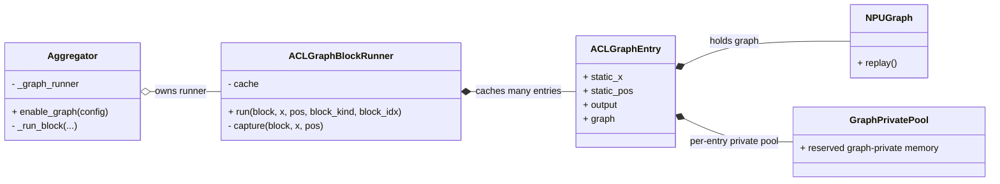
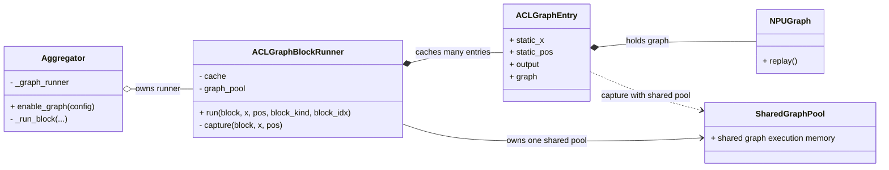
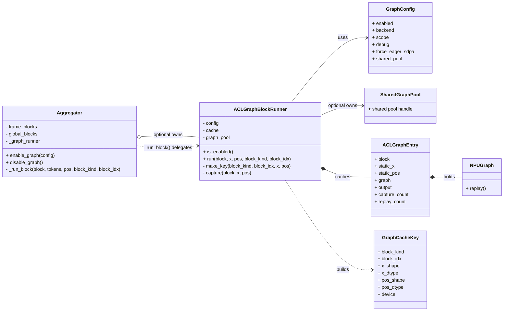

# ACLGraph Shared Pool Notes

## 背景

当前 `VGGT` 的 `Aggregator` 采用的是 Block 级 ACLGraph：

- 每个 `frame block` 独立 capture 一张图
- 每个 `global block` 也独立 capture 一张图
- 默认 `VGGT` 的 `Aggregator.depth=24`，因此总共有 48 个 block graph

如果每张 graph 都各自保留一套 graph-private 执行内存，那么 `graph` 模式下的 `reserved` 显存很容易明显高于 eager。

本轮改动的核心不是改变 graph 粒度，而是让这些 block graph 共享同一个 graph pool，减少重复预留的临时执行内存。

## 图模式显存到底包括什么

把图模式的显存开销拆开看，更容易理解。

### 1. 图对象本身

`torch.npu.NPUGraph` 本身不是显存大头。它更像图的执行句柄和地址关系记录。

### 2. 静态输入输出 buffer

这部分是当前代码里最显式的一层：

- `static_x`
- `static_pos`
- `entry.output`

这些 buffer 的作用是给 replay 提供稳定地址。

### 3. graph-private 临时执行内存

这是最容易被低估、但通常才是大头的部分。包括：

- attention workspace
- matmul workspace
- softmax 等中间执行内存
- capture 后为了 replay 而长期保留的临时地址空间

在 attention-heavy 模型里，这部分可能远大于 `static_x/static_pos/output` 本身。

### 4. pool / reserved

`pool` 不是图对象本身，而是 graph 执行相关的共享内存池。

`reserved` 体现的是：

- runtime 为 graph 执行预留了多少设备内存
- 不等于当前还在被 Python 层活跃 tensor 显式引用的大小

当前场景里，OOM 关注 `reserved` 是合理的，因为设备内存一旦被大量 reserve，后续分配仍然会失败。

## 为什么 Block 粒度 graph 特别容易吃亏

Block 粒度 graph 的优点是接入简单、边界清楚、回退方便。

但它在显存上很容易吃亏，原因是：

- eager 模式下，不同 block 的中间工作区很多时候可以沿层复用
- Block 级 graph 下，如果每个 block 都独立 capture，一张图就可能保留一套自己的执行内存环境
- 当前 `Aggregator` 不是 1 张图，而是 48 张图
- `global block` 的 token 数更大，attention 中间工作区尤其容易变成显存大头

因此，Block 粒度 graph 很容易出现：

- 性能收益不明显
- `reserved` 却显著变大

## shared pool 想缓解什么

shared pool 想缓解的，不是简单把所有 graph 的输入输出揉成一份，而是尽量让多个 graph 共享：

- graph-private 临时执行内存
- replay 时所需的临时 workspace
- 原本按 graph 独占的部分 reserved 空间

它更像：

- 多张 graph 共用一个共享内存池
- 而不是每张 graph 各自维护一套独立 pool

## 内存复用及复用时机安全：各层职责

这一节是这次讨论里最重要的抽象。

### 1. operator / kernel

算子只认：

- 当前传入的地址
- shape / dtype / 参数

算子本身不理解：

- 这块地址之前给谁用过
- 之后会不会被别的 graph 复用
- 现在系统里是否还有其他 graph

所以，算子层不负责内存复用安全。

### 2. graph / NPUGraph

单张 graph 负责：

- 固定这张图 replay 时的执行关系
- 固定这张图依赖的一组地址关系

graph 自己不理解业务模型里的“第几个 block”，也不理解全局 graph 调度策略。

### 3. runtime

runtime 负责：

- 决定 capture / replay 何时发生
- 保证单图 replay 时地址关系成立
- 决定哪些复用前提必须满足
- 在不能证明安全时，宁可保守占内存，也不乱复用

runtime 不一定理解业务语义，但它能依赖：

- 外层调用顺序
- 执行流顺序
- graph capture/replay 的约束

### 4. pool

pool 负责：

- 提供共享内存来源
- 为多个 graph 提供统一的 graph 执行内存池

pool 不负责：

- 理解业务级 block 顺序
- 自动保证并发安全
- 代替 runtime 做图调度

所以，pool 是“共享内存池”，不是“图调度器”。

### 5. host / model code

host/model code 负责提供 shared pool 能安全成立的外层前提，例如：

- graph 之间按串行调用
- 不并发 replay 共享同一 pool 的 graph
- runner 生命周期统一
- graph 使用范围明确

在当前 `Aggregator` 里，外层主干本来就是串行 block 调用链，这正是 shared pool 最容易成立的场景。

## 什么叫“复用时机安全”

“复用时机安全”不是说 runtime 预测了未来所有 replay 路径，而是说：

- 单张 graph replay 时需要的地址关系必须成立
- 被复用的那部分内存不能在多个 graph 间同时活跃冲突
- 外层执行模型必须满足串行、非并发等前提

一句话概括：

- 关键不是“顺序是否唯一固定”
- 而是“生命周期是否重叠”

对于当前 `Aggregator` 这类串行 block 链，shared pool 是自然的；如果未来把共享同一 pool 的 graph 并发执行，就不应再默认认为安全。

## 为什么 shared pool 本身不是并发保险机制

shared pool 只是内存复用机制，不是并发安全保证。

如果后续有人：

- 用不同线程并发 replay 多张 graph
- 用不同 stream 并发执行共享同一 pool 的 graph
- 破坏当前默认的串行调用约束

那正确性就不能再靠 shared pool 自动兜底。

工程上要靠的是：

- 设计上禁止并发
- 或者使用独立 pool 隔离
- 或者更上层显式同步/加锁

## 当前案例：无 shared pool vs shared pool

### 无 shared pool

这个模式下，每个 entry 对应的 graph 都可能长期保留自己的一套 graph-private 执行内存。

### shared pool

这个模式下，graph 仍然是按 block 分开的，但 graph-private 执行内存来源尽量统一到 runner 级别的 shared pool。

## 当前代码关系图

## 结论

当前这次 shared pool 改动的目标很明确：

- 不改变 Block 级 graph 结构
- 不引入 compile/GE 路线
- 只把原本每个 graph 各自维护执行内存的方式，收敛到 runner 级别共享 pool

如果后续要继续优化，下一步才值得讨论：

- graph 粒度是否继续维持 Block 级
- attention 路径是否改成更适合 graph 的 fused op
- benchmark 是否需要把 capture 峰值和 steady-state replay 峰值分开看
