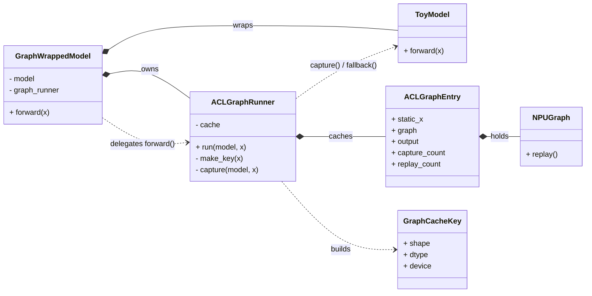
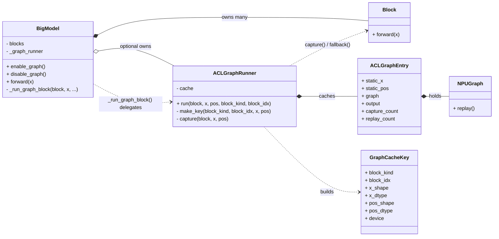
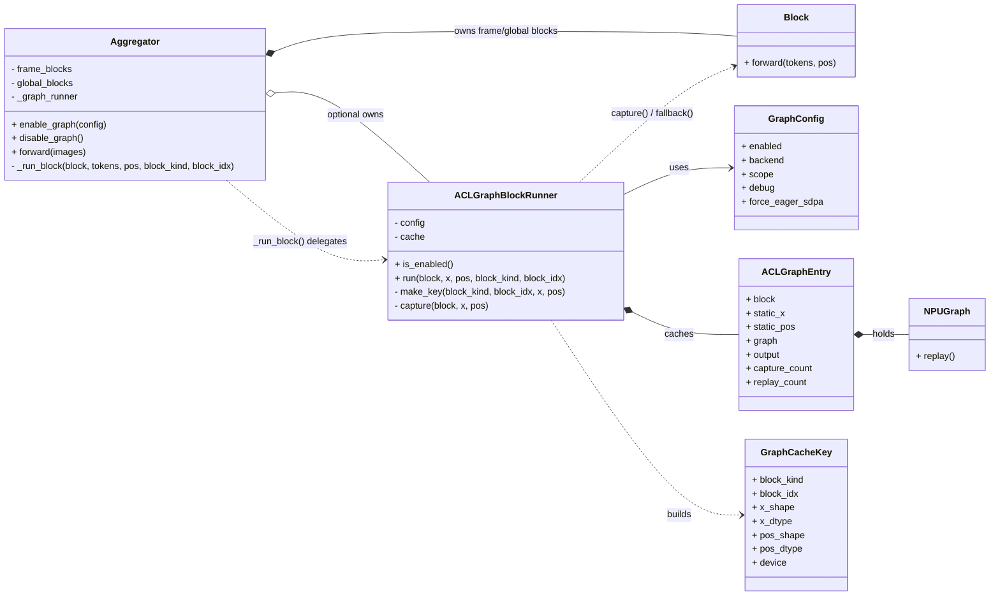

# ACLGraph 最小模板与学习笔记

## 定位

这份文档的目标不是解释 Ascend 全部编译链路，而是给你一个可以直接照着写的最小 ACLGraph 模板。

文档覆盖两种场景：

- 整模型入图：你只有一个 `model(x)`，想先把整个前向包进 graph。
- 局部子图入图：你有一个更大的类，只想先把其中一部分子模块接进 graph。

这里说的 ACLGraph，特指 `torch.npu.NPUGraph` 这一类 runtime graph capture / replay 路线。它和 FX/AOT compile、pass manager、GE 编译是两条不同路线：

- runtime graph capture：运行时录图，核心是 `capture -> replay`
- FX/AOT compile：先抽图、改图、编译，再执行

如果你之前做过“本地保存 FX 图”的开发，要先把这两条路线分开理解。它们都和“图”有关，但不是同一套机制。

## 最小背景知识

### 1. eager、capture、replay 分别是什么

- eager：普通 PyTorch 前向，`model(x)` 怎么写就怎么逐步执行。
- capture：在一组固定输入形状上，把一次真实前向录成 graph。
- replay：后续同条件输入不再重新解释 Python 前向，而是直接重放这张 graph。

要特别注意：

- 第一次 `runner.run(...)` 通常不是 replay，而是 capture，并且 capture 过程中会执行一次真实前向。
- replay 能省掉的是 host 侧逐算子调度开销，不等于“自动融合一切算子”。

### 2. 什么是静态输入 buffer

graph replay 一般依赖 capture 时绑定的那一组输入 / 输出内存地址。因此常见写法不是“每次 replay 都喂一块新 tensor”，而是：

1. capture 前先准备 `static_x`
2. 用 `static_x` 录图
3. 之后每次 replay 前，先 `static_x.copy_(new_x)`
4. 再 `graph.replay()`

这就是为什么 graph 常常和“静态 shape”绑定得很紧。

### 3. 什么是 graph cache

一张图不是“某段代码永远复用”，而是“某个模块在某类输入条件下复用”。

常见 cache key 至少包含：

- 这是哪一个模块
- 输入 shape
- 输入 dtype
- device

在本仓库里，对应的命名是 [aclgraph_runner.py](/C:/Users/OmniInfer/Desktop/zh00942897/code/code_v1/vggt/vggt_zh/vggt/graph/aclgraph_runner.py#L15) 里的 `GraphCacheKey`。

### 4. 为什么复用单位通常是“同一模块实例 + 同形状输入”

很多初学者会问：两个 block 结构明明一样，为什么不能直接复用同一张图？

关键点在于：当前这种 `NPUGraph` capture 写法，绑定的不只是算子拓扑，还绑定了这次 capture 过程中真实用到的模块实例、参数地址、输入输出地址。

所以：

- 同结构模块，不一定能复用同一张 graph
- 同一个模块实例、同样的 shape / dtype / device，才是更常见的复用单位

如果想让“结构相同但参数不同”的模块共用一张图，通常要把参数也变成显式输入，或者走另一套更偏 compiler 的抽象方式。这已经超出最小模板范围了。

## 第一部分：整模型最小模板

这一部分假设你只有一个最简单的模型：

```python
class ToyModel(nn.Module):
    def forward(self, x):
        return self.net(x)
```

并且你先假设图中的算子都支持入图，不考虑算子兼容性问题。

### 1. 一个最小的 entry 结构

这是最小可用的 graph cache entry。命名和本仓库保持一致：

```python
from dataclasses import dataclass
from typing import Dict, Tuple
import torch
from torch import nn

GraphCacheKey = Tuple[Tuple[int, ...], torch.dtype, str]


@dataclass
class ACLGraphEntry:
    static_x: torch.Tensor
    graph: "torch.npu.NPUGraph"
    output: torch.Tensor
    capture_count: int = 1
    replay_count: int = 0
```

这几个字段分别表示：

- `static_x`：capture 时绑定的静态输入 buffer
- `graph`：真正的 `torch.npu.NPUGraph`
- `output`：capture 时绑定的输出 tensor 引用
- `capture_count` / `replay_count`：方便调试

### 2. 一个最小的整模型 runner

下面是最小模板：

```python
class ACLGraphRunner:
    def __init__(self):
        self.cache: Dict[GraphCacheKey, ACLGraphEntry] = {}

    @staticmethod
    def _npu_available() -> bool:
        return (
            hasattr(torch, "npu")
            and callable(getattr(torch.npu, "is_available", None))
            and torch.npu.is_available()
            and hasattr(torch.npu, "NPUGraph")
            and hasattr(torch.npu, "graph")
        )

    def _make_key(self, x: torch.Tensor) -> GraphCacheKey:
        return (tuple(x.shape), x.dtype, str(x.device))

    def run(self, model: nn.Module, x: torch.Tensor) -> torch.Tensor:
        if not self._npu_available():
            return model(x)

        key = self._make_key(x)
        entry = self.cache.get(key)
        if entry is None:
            entry = self._capture(model, x)
            self.cache[key] = entry
            return entry.output

        entry.static_x.copy_(x)
        entry.graph.replay()
        entry.replay_count += 1
        return entry.output

    def _capture(self, model: nn.Module, x: torch.Tensor) -> ACLGraphEntry:
        static_x = x.detach().clone()

        if hasattr(torch.npu, "synchronize"):
            torch.npu.synchronize()

        graph = torch.npu.NPUGraph()
        with torch.npu.graph(graph, auto_dispatch_capture=True):
            output = model(static_x)

        if hasattr(torch.npu, "synchronize"):
            torch.npu.synchronize()

        return ACLGraphEntry(
            static_x=static_x,
            graph=graph,
            output=output,
        )
```

这个模板里最重要的三个点是：

- 第一次调用 `run()` 时，没有 cache，于是进入 `_capture()`
- `_capture()` 里会真的执行一次 `model(static_x)`
- 后续 replay 时直接返回 `entry.output`

### 3. 为什么 `return entry.output` 就够了

这是 graph 新手最容易困惑的地方。

`entry.output` 不是一次前向结果的“快照副本”，而是 capture 时那块输出内存的 Python 引用。后续 replay 执行时，底层会把新的结果写回同一块输出 buffer，所以虽然 `entry.output` 这个 Python 对象没变，但它底层对应的内容已经刷新了。

可以把它理解成：

- `entry.output` 是一个窗口
- replay 后窗口没换
- 但窗口后面的内容变了

### 4. 怎样把它接到 `model(x)` 入口

最简单的接法是再包一层：

```python
class GraphWrappedModel(nn.Module):
    def __init__(self, model: nn.Module):
        super().__init__()
        self.model = model
        self.graph_runner = ACLGraphRunner()

    def forward(self, x: torch.Tensor) -> torch.Tensor:
        if self.training:
            return self.model(x)
        return self.graph_runner.run(self.model, x)
```

这样你就有了一个最小的“整模型入图”入口：

- 训练态：仍走 eager
- 推理态：第一次 capture，后续 replay

### 5. 带 fallback 的更稳妥模板

更实际的写法通常会在 capture / replay 外面包一层异常回退：

```python
def run(self, model: nn.Module, x: torch.Tensor) -> torch.Tensor:
    if not self._npu_available():
        return model(x)

    key = self._make_key(x)
    entry = self.cache.get(key)
    if entry is None:
        try:
            entry = self._capture(model, x)
        except Exception:
            return model(x)
        self.cache[key] = entry
        return entry.output

    try:
        entry.static_x.copy_(x)
        entry.graph.replay()
        entry.replay_count += 1
        return entry.output
    except Exception:
        return model(x)
```

这也是本仓库现在的基本思路，见 [aclgraph_runner.py](/C:/Users/OmniInfer/Desktop/zh00942897/code/code_v1/vggt/vggt_zh/vggt/graph/aclgraph_runner.py#L89)。

## 对象关系图

既然现在 Mermaid 渲染已经恢复，这里回到更标准的 `classDiagram` 写法。目标是用接近 UML 类图的方式，把“谁持有谁、谁调用谁、谁缓存谁”表达清楚。

先约定一下图里的关系含义：

- `*--`：组合。强拥有，生命周期通常绑定。
- `o--`：聚合。弱拥有，可选持有。
- `..>`：依赖。调用或使用，但不长期拥有。
- `-->`：关联。存在明确引用关系。

### 1. 整模型入图：UML 类图



这张图对应的是“我只有一个 `model(x)`，想整体包一层 graph”的情况。

职责拆解如下：

- `GraphWrappedModel`：对外统一入口，决定当前是走 eager 还是交给 runner。
- `ToyModel`：真实业务模型，不关心 graph 细节。
- `ACLGraphRunner`：负责查 cache、capture、replay、fallback。
- `ACLGraphEntry`：保存某一张已捕获图对应的静态输入、输出引用和图实例。
- `GraphCacheKey`：唯一标识一张图可否复用的条件。
- `NPUGraph`：底层 replay 执行体。

### 2. 局部子图入图：UML 类图



这张图对应的是“模型整体不入图，只在类内部挑一个局部入口入图”的情况。

你可以重点看这几条关系：

- `BigModel o-- ACLGraphRunner`
  说明 `_graph_runner` 是可选的。不开 graph 时，它可以不存在。

- `BigModel ..> ACLGraphRunner`
  说明真正发生 graph 调用的地方，是 `_run_graph_block(...)` 这种统一入口。

- `ACLGraphRunner *-- ACLGraphEntry`
  说明 runner 的 cache 里保存了多张已捕获图的运行时记录。

- `ACLGraphRunner ..> GraphCacheKey`
  说明 runner 需要根据输入条件构造 key，再决定复用哪一张图。

### 3. 本仓库当前实现：UML 类图



这张图最适合你现在对照代码看：

- [aggregator.py](/C:/Users/OmniInfer/Desktop/zh00942897/code/code_v1/vggt/vggt_zh/vggt/models/aggregator.py)
- [aclgraph_runner.py](/C:/Users/OmniInfer/Desktop/zh00942897/code/code_v1/vggt/vggt_zh/vggt/graph/aclgraph_runner.py)
- [config.py](/C:/Users/OmniInfer/Desktop/zh00942897/code/code_v1/vggt/vggt_zh/vggt/graph/config.py)

### 4. 用一句话理解这几层关系

如果只记一条主线，可以记成：

- 业务模型类：`ToyModel` / `BigModel` / `Aggregator`
- graph 调度类：`ACLGraphRunner` / `ACLGraphBlockRunner`
- graph 记录类：`ACLGraphEntry`
- graph 复用条件：`GraphCacheKey`
- 底层执行体：`torch.npu.NPUGraph`

也就是：

- 模型不直接管理图细节
- runner 管图
- entry 记住一张图的运行时资源
- key 决定复用哪张图
- `NPUGraph` 负责真正 replay

## 第二部分：在大类里局部入图

整模型入图是最简单的模板，但很多时候你不会一上来就包整个 `forward()`，而是先挑一个“重复、边界清楚、推理态稳定”的子模块入图。

这时更推荐的模式是：

- 类里保留原始 eager 逻辑
- 增加一个 `self._graph_runner`
- 给子模块执行留一个统一入口

### 1. 最小伪代码模板

```python
class BigModel(nn.Module):
    def __init__(self):
        super().__init__()
        self.blocks = nn.ModuleList([...])
        self._graph_runner = None

    def enable_graph(self):
        self._graph_runner = ACLGraphRunner()

    def disable_graph(self):
        self._graph_runner = None

    def _run_graph_block(self, block, x, block_kind: str, block_idx: int):
        if self.training or self._graph_runner is None:
            return block(x)
        return self._graph_runner.run_block(
            block,
            x,
            block_kind=block_kind,
            block_idx=block_idx,
        )

    def forward(self, x):
        for idx, block in enumerate(self.blocks):
            x = self._run_graph_block(block, x, block_kind="encoder", block_idx=idx)
        return x
```

这个模式的好处是：

- 图逻辑没有散落到整个 `forward()`
- 原 eager 路径非常清楚
- 你后面想逐层扩展时，只需要继续把更多子模块接到 `_run_graph_block(...)`

### 2. 对应到本仓库的写法

本仓库的 `Aggregator` 走的就是这个模式：

- `_graph_runner` 字段：见 [aggregator.py](/C:/Users/OmniInfer/Desktop/zh00942897/code/code_v1/vggt/vggt_zh/vggt/models/aggregator.py#L149)
- `enable_graph()` / `disable_graph()`：见 [aggregator.py](/C:/Users/OmniInfer/Desktop/zh00942897/code/code_v1/vggt/vggt_zh/vggt/models/aggregator.py#L151)
- `_run_block(...)` 统一入口：见 [aggregator.py](/C:/Users/OmniInfer/Desktop/zh00942897/code/code_v1/vggt/vggt_zh/vggt/models/aggregator.py#L330)

然后：

- `_process_frame_attention(...)` 里不直接调 block，而是走 `_run_block(...)`
- `_process_global_attention(...)` 里也一样

这就是“在一个大类里局部入图”的典型工程写法。

### 3. 为什么最好留一个统一入口，而不是到处写 graph 判断

不推荐这样写：

```python
if use_graph:
    ...
else:
    ...
```

散落在很多地方的原因是：

- 很难维护
- 很难保证 eager / graph 路径行为一致
- 后面想回退时容易漏逻辑

更好的方式是：

- 先找到所有候选子模块的唯一调用点
- 在这里做一次统一切换

本仓库里，这个统一入口就是 `_run_block(...)`。

### 4. 如果你要做“逐层扩展”

很多真实开发不是一次性整块入图，而是按下面顺序推进：

1. 先给某一类 block 做图前向
2. 再接到模型主干
3. 再把更多 block 类型接进来

这种情况下，建议你在类内部始终保留一个像下面这样的入口：

```python
def _run_graph_block(self, block, x, pos=None, block_kind="", block_idx=0):
    if self.training or self._graph_runner is None:
        return block(x, pos=pos)
    return self._graph_runner.run(block, x, pos, block_kind=block_kind, block_idx=block_idx)
```

这样“逐层拓展”的时候，类外接口不需要一直改，graph 逻辑也不会到处蔓延。

## 第三部分：测试模板

graph 开发不要先靠大模型真实样例验证，先写最小测试。最推荐的三类测试如下。

### 1. eager vs 首次 capture 输出一致

这是最基础的一条。

本仓库对应的是 [test_aclgraph.py](/C:/Users/OmniInfer/Desktop/zh00942897/code/code_v1/vggt/vggt_zh/test/test_aclgraph.py#L73)：

```python
def test_aclgraph_block_matches_eager():
    ref = block(x, pos=pos)
    out = runner.run(block, x, pos, block_kind="frame", block_idx=0)

    assert len(runner.cache) == 1
    assert out.shape == ref.shape
    assert torch.allclose(ref, out, atol=1e-3, rtol=1e-3)
```

它主要验证：

- 第一次 `runner.run(...)` 触发了 capture
- 首次 capture 产生的输出和 eager 一致

### 2. 同 shape 第二次 replay 生效

本仓库对应的是 [test_aclgraph.py](/C:/Users/OmniInfer/Desktop/zh00942897/code/code_v1/vggt/vggt_zh/test/test_aclgraph.py#L95)：

```python
def test_aclgraph_runner_replays_same_shape_and_caches_new_shape():
    runner.run(block, x, pos, block_kind="frame", block_idx=0)
    runner.run(block, x, pos, block_kind="frame", block_idx=0)

    assert len(runner.cache) == 1
    entry = next(iter(runner.cache.values()))
    assert entry.replay_count >= 1
```

它验证的是：

- 同 shape 第二次调用没有新建图
- 而是复用了旧图

### 3. 不同 shape 新建新图

同一个测试的后半段已经覆盖了这一点：

```python
x2 = torch.randn(3, 17, 64, device=device, dtype=torch.float32)
pos2 = _build_positions(batch_size=3, seq_len=17, device=device)
runner.run(block, x2, pos2, block_kind="frame", block_idx=0)

assert len(runner.cache) == 2
```

这说明 graph cache 的单位不是“这个 block 编过一次就永远复用”，而是“这个 block 在某类输入条件下复用”。

### 4. 当前仓库还缺的一条测试

当前仓库的测试已经覆盖了：

- capture correctness
- cache 复用
- 整体 eager 对齐

但它还没有一条更直接的独立测试，去验证：

- 同 shape
- 不同输入
- replay 之后 `entry.output` 确实被刷新成了新结果

推荐补充下面这种测试：

```python
def test_aclgraph_replay_refreshes_output_buffer():
    device = _require_aclgraph_npu()
    block = _build_block(device)
    runner = ACLGraphBlockRunner(GraphConfig(enabled=True, debug=True))

    x1 = torch.randn(2, 17, 64, device=device, dtype=torch.float32)
    x2 = torch.randn(2, 17, 64, device=device, dtype=torch.float32)
    pos = _build_positions(batch_size=2, seq_len=17, device=device)

    with torch.no_grad():
        ref1 = block(x1, pos=pos)
        out1 = runner.run(block, x1, pos, block_kind="frame", block_idx=0)

        ref2 = block(x2, pos=pos)
        out2 = runner.run(block, x2, pos, block_kind="frame", block_idx=0)

    assert torch.allclose(ref1, out1, atol=1e-3, rtol=1e-3)
    assert torch.allclose(ref2, out2, atol=1e-3, rtol=1e-3)
    assert not torch.allclose(out1, out2, atol=1e-6, rtol=1e-6)
```

这条测试更直接回答了一个常见疑问：

- `entry.output` 只是一个引用，为什么 replay 后结果会变？

因为 replay 会更新它背后的那块输出内存。

## 第四部分：常见失败原因与排查顺序

这一部分吸收了这次实际开发里踩过的坑。

### 1. host 同步问题

典型危险写法有：

- `int(tensor)`
- `tensor.item()`
- 用设备张量值驱动 Python 分支
- 用设备张量值去构造 Python cache key

本仓库第一次失败就是这个问题。最早在 [rope.py](/C:/Users/OmniInfer/Desktop/zh00942897/code/code_v1/vggt/vggt_zh/vggt/layers/rope.py#L183) 里有：

```python
max_position = int(positions.max()) + 1
```

在 eager 下没问题，但在 graph capture 里，这一步会把设备值同步回 host，于是触发 capture 期间非法同步。

后来采用的修法是：

- eager 路径语义尽量不变
- graph capture 前在 runner 里先算好精确值
- capture 期间不再做 `int(device_tensor)`

对应实现见：

- `_resolve_max_position(...)`：[aclgraph_runner.py](/C:/Users/OmniInfer/Desktop/zh00942897/code/code_v1/vggt/vggt_zh/vggt/graph/aclgraph_runner.py#L52)
- `_set_rope_override(...)`：[aclgraph_runner.py](/C:/Users/OmniInfer/Desktop/zh00942897/code/code_v1/vggt/vggt_zh/vggt/graph/aclgraph_runner.py#L57)
- `set_max_position_override(...)`：[rope.py](/C:/Users/OmniInfer/Desktop/zh00942897/code/code_v1/vggt/vggt_zh/vggt/layers/rope.py#L120)

### 2. stream capture 问题

这次第二类失败是：

```text
capture model contains a stream that was not joined to the original stream
```

这类报错通常意味着 capture 期间有额外 stream 被派发了，但没有被正确并回主 capture stream。

当前仓库里的做法是：

```python
with torch.npu.graph(graph, auto_dispatch_capture=True):
```

对应见 [aclgraph_runner.py](/C:/Users/OmniInfer/Desktop/zh00942897/code/code_v1/vggt/vggt_zh/vggt/graph/aclgraph_runner.py#L147)。

可以把 `auto_dispatch_capture=True` 粗略理解成：尽量把 capture 期间内部派发的 stream 一并纳入 capture。

### 3. 特定算子路径不稳定

即使 host 同步和 stream 问题都处理了，还是可能有某些高层算子路径在 graph 下不稳定。

这次为了先把测试跑通，最终采取的是：

- graph 模式下先不走 fused SDPA 路径
- 显式让 `fused_attn=False`

对应位置：

- `GraphConfig.force_eager_sdpa`：[config.py](/C:/Users/OmniInfer/Desktop/zh00942897/code/code_v1/vggt/vggt_zh/vggt/graph/config.py#L5)
- `Aggregator.enable_graph(...)`：[aggregator.py](/C:/Users/OmniInfer/Desktop/zh00942897/code/code_v1/vggt/vggt_zh/vggt/models/aggregator.py#L151)
- 测试里的 `Block(..., fused_attn=False)`：[test_aclgraph.py](/C:/Users/OmniInfer/Desktop/zh00942897/code/code_v1/vggt/vggt_zh/test/test_aclgraph.py#L31)

这背后的工程原则是：

- 第一优先级不是保留所有最快路径
- 第一优先级是先找到一条稳定可 capture 的路径

### 4. capture 失败后的进程污染

这次还遇到过：

```text
Offset increment outside graph capture encountered unexpectedly
```

这个报错很容易误导人。它很多时候不是新的根因，而是前面 graph capture 失败后，当前进程里的 graph 状态没有恢复干净，导致后续连普通 `torch.rand` / `torch.randn` 都开始异常。

所以看到这种报错时，通常要先回头看更早的第一条 capture 失败日志，而不是单独分析这条“后效应”。

### 5. 建议的排查顺序

调 graph 出错时，推荐固定按这个顺序看：

1. 先看第一条失败，不要先看后续连锁报错
2. 判断是否有 host 同步
3. 判断是否有 stream capture 问题
4. 判断是否是某条特定算子路径不稳定
5. 如果失败后环境被污染，重启干净进程再复现

## 第五部分：和 omni-npu 的关系

如果你之前接触过 `omni-npu`，会觉得“我以前不是还会保存 FX 图、或者看到更多编译对象吗，为什么这次没有？”

关键是要分清两条路线。

### 1. 本仓库现在走的是 runtime capture 路线

本仓库这次实现的核心对象是：

- `torch.npu.NPUGraph`

也就是：

- 运行时拿真实输入录图
- 缓存 graph
- 同条件下 replay

这一条路线本身不要求落地本地 FX 图文件。

### 2. omni-npu 的 `acl_graph.py` 其实也是 runtime capture

你工作区里的参考实现是 [acl_graph.py](/C:/Users/OmniInfer/Desktop/zh00942897/code/code_v1/vggt/omni-npu_vggt/src/omni_npu/compilation/acl_graph.py)。

它虽然更工程化，但本质上仍然是 runtime capture / replay，而不是“本地持久化 FX 图”。

它比本仓库当前简化版多做了几件事：

- `graph_pool`：复用 graph pool
- `input_addresses`：记录 capture 时输入地址，并在 replay 时检查
- `weak_ref_tensors(output)`：把输出做弱引用管理，减少内存长期占用
- `auto_dispatch_capture=True`：处理 capture 期间的 stream 派发

这些点都能在 [acl_graph.py](/C:/Users/OmniInfer/Desktop/zh00942897/code/code_v1/vggt/omni-npu_vggt/src/omni_npu/compilation/acl_graph.py#L58) 附近看到。

### 3. 为什么你以前会看到 FX 图

那通常意味着你当时走的不是单纯 `NPUGraph` runtime capture，而是另一类路径，例如：

- FX trace / FX pass
- AOT compile
- GE 编译链路
- 更上层的图编译框架

这些路线里，“先拿到一张 IR / FX 图，再做改写或持久化”是常见现象；但这和当前这里的 `NPUGraph` 用法不是一回事。

所以这次没有本地 FX 图，不代表“没入图”，而是说明：

- 这次入的是 runtime graph
- 不是 compiler IR 图

## 回到本仓库：几个关键术语怎么理解

为了方便你对照当前实现，最后把几个核心名词再收一下。

### `GraphCacheKey`

对应 [aclgraph_runner.py](/C:/Users/OmniInfer/Desktop/zh00942897/code/code_v1/vggt/vggt_zh/vggt/graph/aclgraph_runner.py#L15)。

它的作用不是“给 block 起名字”，而是唯一标识一张图的复用条件。当前包含：

- `block_kind`
- `block_idx`
- `x.shape`
- `x.dtype`
- `pos.shape`
- `pos.dtype`
- `device`

### `ACLGraphEntry`

对应 [aclgraph_runner.py](/C:/Users/OmniInfer/Desktop/zh00942897/code/code_v1/vggt/vggt_zh/vggt/graph/aclgraph_runner.py#L26)。

它保存一张已 capture 图的运行时上下文，当前包括：

- `block`
- `static_x`
- `static_pos`
- `graph`
- `output`

其中最容易误解的是 `output`：

- 它不是结果快照
- 它是 capture 时绑定的输出 tensor 引用
- replay 更新的是它背后的内存

### `static_x` / `static_pos`

对应 [aclgraph_runner.py](/C:/Users/OmniInfer/Desktop/zh00942897/code/code_v1/vggt/vggt_zh/vggt/graph/aclgraph_runner.py#L137)。

它们是 graph replay 之前被 `copy_()` 覆盖的静态输入 buffer。

### `auto_dispatch_capture=True`

对应 [aclgraph_runner.py](/C:/Users/OmniInfer/Desktop/zh00942897/code/code_v1/vggt/vggt_zh/vggt/graph/aclgraph_runner.py#L147)。

这是这次实际调通过程中一个很关键的 capture 参数，用来降低 stream capture 问题。

## 最后给初学者的一条建议

给一个陌生 torch 模型做入图时，最稳妥的顺序通常是：

1. 先找重复、边界清楚、推理态稳定的子模块
2. 先写局部 eager vs capture 测试
3. 再设计 graph cache 和静态 buffer
4. 再接回主模型
5. 最后再考虑更大范围的入图和更激进的优化

不要一上来就试整模型全图，也不要一开始就把 graph 逻辑散到很多业务分支里。


